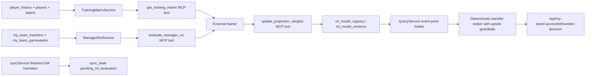

# feat: ML Transfer Engine V2 With Guardrails

## Overview

Plan the revised ML-powered transfer-decision pipeline so FPLytics can learn event weights and manager-specific risk inputs without regressing the recent deterministic ranking fixes. The architecture should keep the existing transfer-decision API and web UI stable, expose safe MCP tools for external training scripts, persist model versions explicitly in SQLite, and add a retry-friendly automation seam after finished gameweeks.

The key constraint in this revision is that ML should improve expected raw points and manager risk calibration, but it must not replace the deterministic recommendation guardrails that currently prevent low-value goalkeeper, defender, or bench churn from surfacing as the best move.

## Problem Frame

The current transfer-decision engine already contains product-critical ranking behavior: starter-vs-bench penalties, positional upside bias, and plain-English explanation strings that map to deterministic event concepts. The revised PRD asks for an ML upgrade, but with explicit stability protections:

- the model should output event-based expected raw points, not final transfer rankings
- the current post-processing ranker should remain responsible for upside bias and candidate viability
- sparse manager history should not create erratic risk-posture swings
- finished-gameweek automation must be retryable rather than a fragile one-shot trigger
- learned model versions must be explicitly persisted and rollback-safe

This is a deep, cross-cutting change because it touches the MCP layer, SQLite schema, sync lifecycle, manager-history analytics, and the current transfer-decision scoring internals in the API.

## Requirements Trace

### 1. Step 1: Supervised Event Model & Positional Guardrails

- R1. Create a `get_training_matrix` MCP tool that returns a double-gameweek-safe supervised event dataset with strict lookahead prevention.
- R2. Keep the ML model scoped to expected raw event composition and projected points, not final recommendation ranking.
- R3. Preserve the current deterministic post-processing layer for positional upside bias, starter-vs-bench penalties, and candidate viability.
- R4. Keep the live transfer-decision explanations aligned with the current event-based plain-English semantics even after learned raw-point inputs are introduced.

### 2. Step 2: Bayesian Manager Risk Profiling

- R5. Create an `evaluate_manager_roi` MCP tool that computes manager transfer outcomes and point-hit ROI.
- R6. Apply Bayesian shrinkage to manager profiling until the manager has enough transfer history to justify fully personalized risk behavior.
- R7. Feed the resulting smoothed manager profile back into hit-cost and flexibility-related transfer inputs without introducing unstable personalization.

### 3. Step 3: Robust Automation Feedback Loop

- R8. Record finished-gameweek ML work as a retryable pending signal in `sync_state` rather than relying on a fire-and-forget trigger.
- R9. Make the pending evaluation flow safe to retry after trainer or network failures so the retraining window is not lost.

### 4. Step 4: Explicit Model Registry Schema

- R10. Add explicit `ml_model_registry` and `ml_model_versions` tables for versioned coefficient storage, activation, and rollback.
- R11. Create an `update_projection_weights` MCP tool that validates and writes coefficient payloads into the model-version store.
- R12. Keep `GET /api/my-team/:accountId/transfer-decision` unchanged at the contract level while consuming the active model version at runtime.

## Scope Boundaries

- No new transfer-decision REST route or frontend contract in this phase
- No direct ML ownership of the final recommendation ranker
- No runtime source-code mutation of service files
- No in-process model training inside the Express server
- No redesign of the current transfer candidate generation UX beyond what is necessary to keep the existing guardrails intact
- No fragile one-time background trigger with no retry state

## Context & Research

### Relevant Code and Patterns

- [apps/api/src/mcp/createMcpRouter.ts](/Users/iha/github/ianha/fplytics/apps/api/src/mcp/createMcpRouter.ts): current stateless MCP registration point, using `zod`-validated tools and text JSON responses.
- [apps/api/MCP.md](/Users/iha/github/ianha/fplytics/apps/api/MCP.md): current MCP docs and tool/resource expectations.
- [apps/api/src/services/queryService.ts](/Users/iha/github/ianha/fplytics/apps/api/src/services/queryService.ts): current transfer projection, ranking, and explanation logic; the place where deterministic guardrails already live.
- [apps/api/src/db/schema.ts](/Users/iha/github/ianha/fplytics/apps/api/src/db/schema.ts): current schema definitions, including `player_history`, `gameweeks`, `sync_state`, and the `my_team_*` tables.
- [apps/api/src/db/database.ts](/Users/iha/github/ianha/fplytics/apps/api/src/db/database.ts): additive schema/migration style via explicit setup and `ensureColumns`.
- [apps/api/src/services/syncService.ts](/Users/iha/github/ianha/fplytics/apps/api/src/services/syncService.ts): the likely seam for detecting `is_finished` transitions and recording retryable ML evaluation work.
- [apps/api/test/queryService.test.ts](/Users/iha/github/ianha/fplytics/apps/api/test/queryService.test.ts): seeded test style for transfer scoring and ranking behavior.
- [apps/api/test/myTeam.test.ts](/Users/iha/github/ianha/fplytics/apps/api/test/myTeam.test.ts): route-level stability tests for transfer decisions.
- [apps/web/src/pages/MyTeamPage.test.tsx](/Users/iha/github/ianha/fplytics/apps/web/src/pages/MyTeamPage.test.tsx): UI-facing evidence that the transfer-decision contract must remain stable.

### Institutional Learnings

- No `docs/solutions/` directory exists yet, so there are no prior institutional pattern docs to inherit.
- Existing transfer-decision work in this repo is already heavily seeded and deterministic; that is a strong local signal to keep ML contained behind testable, explainable service seams.

### External References

- None used for this plan. The codebase already contains the relevant local constraints and architecture patterns.

## Key Technical Decisions

- Keep ML upstream of the final ranker. The learned model should produce event-based expected points inputs, while the current deterministic ranker keeps ownership of upside bias and anti-churn guardrails.
- Persist model metadata in dedicated tables, but keep retryable automation state in `sync_state`. This follows the revised PRD: model versions need explicit schema, while pending evaluation flags fit the existing key-value state store.
- Implement Bayesian manager profiling as a smoothing layer over ROI outputs rather than an all-or-nothing switch. Sparse histories should shrink toward a global baseline until the sample threshold is reached.
- Use MCP as the integration seam for external training scripts. The Node app should provide data, accept validated weights, and apply them at runtime, not train models in-process.
- Preserve existing transfer-decision contract and explanation semantics. New model inputs should feed the current reason categories rather than invent new UI-facing explanation shapes.
- Add retry-safe finished-gameweek signaling before any more ambitious orchestration. The safe minimum is durable pending work that can be polled and retried.

## PRD Category Mapping

### 1. Step 1: Supervised Event Model & Positional Guardrails

**Why this category matters:**
- The original problem is that hand-tuned projection inputs eventually drift away from real FPL scoring patterns and can miss meaningful changes in event value.
- At the same time, the product has already learned that raw projection quality alone is not enough: recommendation quality also depends on preserving the existing anti-churn ranking guardrails.

**How it helps the original problem:**
- A supervised event model improves projected raw points by learning from actual event outcomes rather than relying only on manual coefficients.
- The positional and starter/bench guardrails ensure those better projections do not regress the user experience into low-ceiling but technically “safe” moves.

**What in this plan serves this category:**
- The no-lookahead, double-gameweek-safe training matrix in Unit 2
- The guarded runtime integration in Unit 5, where learned raw points feed the existing deterministic ranker
- Phase 1, which builds trustworthy training data
- Phase 3, which applies learned weights to live recommendations without removing the guardrails

### 2. Step 2: Bayesian Manager Risk Profiling

**Why this category matters:**
- The original problem is not just generic projection quality; transfer advice also depends on how aggressively or conservatively a specific manager uses hits and values flexibility.
- Sparse personal history can create unstable or misleading personalization if the app reacts too strongly to a handful of transfers.

**How it helps the original problem:**
- Bayesian smoothing lets the system personalize risk posture gradually, preserving stability for newer or lower-data managers while still unlocking stronger personalization for established ones.
- This improves hit-cost and flexibility tuning without producing erratic behavior that would undermine trust in the recommendation engine.

**What in this plan serves this category:**
- The manager ROI profiling service in Unit 3
- The smoothed manager-risk integration into `QueryService` in Unit 5
- Phase 2, which delivers the manager-profile logic and tool surface
- Phase 3, which starts using those smoothed signals in live scoring

### 3. Step 3: Robust Automation Feedback Loop

**Why this category matters:**
- The original problem includes model drift over time. Even a strong learned model becomes stale if it is not retrained against recent outcomes.
- A brittle one-time trigger would quietly break the intended continuous-tuning loop and leave users on stale weights without obvious visibility.

**How it helps the original problem:**
- Durable, retry-safe automation lets the model stay grounded in recent gameweeks and recover from failed external training runs.
- This preserves the long-term value of the ML upgrade instead of turning it into a one-off improvement that decays through the season.

**What in this plan serves this category:**
- The pending ML evaluation state in Unit 1
- The finished-gameweek trigger and retry-safe sync handoff in Unit 6
- Phase 4, which operationalizes the retraining loop after the live model path is in place

### 4. Step 4: Explicit Model Registry Schema

**Why this category matters:**
- Once learned weights affect live recommendations, the system needs safe activation, rollback, auditing, and version tracking.
- Without an explicit registry/version schema, bad model outputs become hard to diagnose, compare, or reverse cleanly.

**How it helps the original problem:**
- A model registry makes the ML layer operationally safe enough for production use.
- It separates durable model-version concerns from transient workflow state, which reduces the risk of corrupted or opaque scoring behavior.

**What in this plan serves this category:**
- The `ml_model_registry` and `ml_model_versions` schema in Unit 1
- The validated write path in Unit 4
- Phase 1, which establishes the storage contract
- Phase 2, which enables validated external publication of coefficients
- Phase 3, which consumes active model versions in live scoring

## Open Questions

### Resolved During Planning

- Should the learned model decide the final transfer recommendation? No. The revised PRD explicitly keeps that responsibility in the deterministic post-processing layer.
- Should sparse manager histories be personalized immediately? No. They should be Bayesian-smoothed toward a global posture until a confidence threshold is reached.
- Should model persistence live entirely in `sync_state`? No. Only pending evaluation flags belong there; model versions need dedicated tables.

### Deferred to Implementation

- Exact coefficient JSON schema for event weights, positional adjustments, and optional horizon-specific parameters.
- Exact Bayesian prior and smoothing formula for manager risk posture once implementation inspects current hit/risk inputs in detail.
- Whether active model weights should be loaded per request or via a short-lived in-memory cache in `QueryService`.
- Whether pending ML evaluation should be represented by a single `sync_state` key, a namespaced set of keys, or a small serialized state object.

## High-Level Technical Design

> *This illustrates the intended approach and is directional guidance for review, not implementation specification. The implementing agent should treat it as context, not code to reproduce.*



Directional design rule:

```text
ML output:
  expected_raw_points_components(player, fixture_horizon)
  manager_risk_profile(account)

Deterministic post-processing:
  candidate viability
  starter-vs-bench penalty
  positional upside bias
  final explanation strings
```

## Implementation Units

- [ ] **Unit 1: Add explicit model registry tables and retryable ML sync state**

**Goal:** Introduce durable storage for model definitions/versions and a separate retryable state flag for pending ML evaluation work.

**Requirements:** R6, R7, R8

**Dependencies:** None

**Files:**
- Modify: `apps/api/src/db/schema.ts`
- Modify: `apps/api/src/db/database.ts`
- Test: `apps/api/test/queryService.test.ts`
- Test: `apps/api/test/app.test.ts`

**Approach:**
- Add `ml_model_registry` for logical model identities and `ml_model_versions` for versioned coefficient payloads, activation state, scope, and timestamps.
- Keep `sync_state` as the place for `pending_ml_evaluation` or equivalent retryable work markers, rather than overloading it with model payloads.
- Follow the repo’s additive schema style so existing databases can upgrade without destructive migrations.
- Ensure activation semantics support safe rollback to the previously active version.

**Patterns to follow:**
- Additive schema definitions in [apps/api/src/db/schema.ts](/Users/iha/github/ianha/fplytics/apps/api/src/db/schema.ts)
- Existing setup/migration style in [apps/api/src/db/database.ts](/Users/iha/github/ianha/fplytics/apps/api/src/db/database.ts)

**Test scenarios:**
- Fresh DB setup creates both model tables and leaves existing transfer-decision data untouched.
- Existing DB setup upgrades cleanly.
- Only one model version is active for a given registry entry at a time.
- Pending ML evaluation flags can persist independently from model-version data.

**Verification:**
- The app can store versioned weights and retryable pending-evaluation state without conflating the two concerns.

- [ ] **Unit 2: Build training-matrix service with strict no-lookahead semantics**

**Goal:** Implement a reusable backend service that exposes trainer-ready supervised data for event modeling.

**Requirements:** R1, R2, R8

**Dependencies:** Unit 1

**Files:**
- Create: `apps/api/src/services/trainingMatrixService.ts`
- Test: `apps/api/test/queryService.test.ts`
- Test: `apps/api/test/app.test.ts`

**Approach:**
- Implement the training matrix as a self-join over `player_history` using full target match identity, not naive row offsets, so double gameweeks stay safe.
- Build features from rolling historical event averages, opponent strength, and `was_home`, with rows restricted to matches strictly before the target gameweek.
- Return trainer-friendly JSON shapes with stable numeric coercion for SQLite `REAL` fields.
- Keep this service focused on expected raw event inputs only; do not leak final-ranking heuristics into the training matrix.

**Execution note:** Start with failing seeded tests for lookahead and double-gameweek handling before finalizing the SQL.

**Patterns to follow:**
- Service-layer data access patterns under `apps/api/src/services/`
- Seeded scenario style in [apps/api/test/queryService.test.ts](/Users/iha/github/ianha/fplytics/apps/api/test/queryService.test.ts)

**Test scenarios:**
- Target-gameweek rows never include same-gameweek or future history.
- Double-gameweek fixtures produce separate target rows keyed by opponent and kickoff.
- Rows with insufficient history are handled consistently with the documented contract.

**Verification:**
- The training matrix can be generated repeatably with strict historical cutoffs and no match identity loss.

- [ ] **Unit 3: Build Bayesian manager ROI profiling service**

**Goal:** Compute transfer ROI and hit performance while smoothing sparse manager histories toward a global baseline.

**Requirements:** R4, R5

**Dependencies:** Unit 1

**Files:**
- Create: `apps/api/src/services/managerRoiService.ts`
- Modify: `apps/api/src/services/queryService.ts`
- Test: `apps/api/test/queryService.test.ts`
- Test: `apps/api/test/myTeam.test.ts`

**Approach:**
- Derive per-transfer outcomes from `my_team_transfers` plus relevant `my_team_gameweeks` cost data, comparing incoming and outgoing player outcomes over the chosen future horizon.
- Compute aggregate manager metrics such as hit ROI, transfer success rate, and preferred risk posture inputs.
- Apply Bayesian shrinkage until the manager’s sample size crosses the PRD’s threshold, so low-data accounts fall back toward a global baseline rather than producing noisy personalization.
- Keep the output usable both for the MCP tool and for live transfer-decision risk adjustments.

**Execution note:** Implement this test-first around sparse-sample and sufficient-sample scenarios because the smoothing boundary is product-critical.

**Patterns to follow:**
- Current my-team data access patterns in `apps/api/src/services/`
- Existing historical transfer fixtures in [apps/api/test/myTeam.test.ts](/Users/iha/github/ianha/fplytics/apps/api/test/myTeam.test.ts)

**Test scenarios:**
- Managers with fewer than 15 relevant transfers are shrunk toward the global baseline.
- Managers above the threshold reflect predominantly personalized values.
- Hit ROI subtracts transfer cost correctly.
- A manager with poor hit history gets a more conservative derived posture than a manager with strong hit ROI.

**Verification:**
- ROI and risk posture outputs remain stable and plausible even when historical data is sparse.

- [ ] **Unit 4: Register MCP tools and validate write contracts**

**Goal:** Expose the training, ROI, and model-update flows through the existing stateless MCP surface.

**Requirements:** R1, R4, R8

**Dependencies:** Units 2-3

**Files:**
- Modify: `apps/api/src/mcp/createMcpRouter.ts`
- Modify: `apps/api/MCP.md`
- Test: `apps/api/test/app.test.ts`

**Approach:**
- Register `get_training_matrix`, `evaluate_manager_roi`, and `update_projection_weights` with explicit `zod` schemas.
- Keep the MCP router thin by delegating all SQL and persistence logic to the new services and model store helpers.
- Validate coefficient payload structure before writing to `ml_model_versions`.
- Document the no-lookahead guarantee, Bayesian manager smoothing behavior, and model-version activation semantics in the MCP docs.

**Patterns to follow:**
- Existing tool registration style in [apps/api/src/mcp/createMcpRouter.ts](/Users/iha/github/ianha/fplytics/apps/api/src/mcp/createMcpRouter.ts)
- Current docs format in [apps/api/MCP.md](/Users/iha/github/ianha/fplytics/apps/api/MCP.md)

**Test scenarios:**
- Invalid tool parameters return structured errors.
- Malformed model coefficient payloads are rejected.
- Successful tool calls return documented JSON payloads and activate only validated model versions.

**Verification:**
- External trainers can use the current MCP endpoint safely for both reads and controlled model writes.

- [ ] **Unit 5: Refactor QueryService to consume learned raw-point inputs while preserving ranking guardrails**

**Goal:** Make the live transfer-decision engine load learned event-point inputs and manager risk profiles without giving up the deterministic anti-churn ranking logic.

**Requirements:** R2, R3, R5, R9

**Dependencies:** Units 1-4

**Files:**
- Modify: `apps/api/src/services/queryService.ts`
- Modify: `apps/api/src/routes/createApiRouter.ts`
- Test: `apps/api/test/queryService.test.ts`
- Test: `apps/api/test/myTeam.test.ts`
- Test: `apps/web/src/pages/MyTeamPage.test.tsx`

**Approach:**
- Extract the current hard-coded event-point coefficients and risk parameters behind a loadable configuration seam.
- Load the active model-version coefficients for raw expected points while preserving deterministic fallback defaults.
- Keep the existing post-processing ranker responsible for starter-vs-bench penalties, positional upside bias, and candidate viability, even after learned raw-point estimates are introduced.
- Feed smoothed manager risk-profile outputs into hit-cost and flexibility adjustments without changing the REST response shape.
- Preserve the current explanation categories so UI strings remain stable and human-readable.

**Execution note:** Add characterization coverage around current transfer-decision ranking behavior before swapping in learned raw-point inputs.

**Patterns to follow:**
- Existing transfer-decision contract handling in [apps/api/src/routes/createApiRouter.ts](/Users/iha/github/ianha/fplytics/apps/api/src/routes/createApiRouter.ts)
- Existing deterministic ranking tests in [apps/api/test/queryService.test.ts](/Users/iha/github/ianha/fplytics/apps/api/test/queryService.test.ts)

**Test scenarios:**
- With no active learned model, existing behavior remains available via deterministic defaults.
- Learned raw-point inputs can change projected gain while the same anti-churn ranking guardrails still block low-value goalkeeper or bench churn.
- Explanations still render using the current plain-English categories.
- The My Team page consumes the same transfer-decision response shape without client changes.

**Verification:**
- ML improves projection inputs, but the final recommendation engine still behaves like the guarded deterministic workflow the product expects.

- [ ] **Unit 6: Add retry-safe finished-gameweek ML automation hooks**

**Goal:** Record and maintain durable pending evaluation work whenever a gameweek finishes so external trainers can poll and retry safely.

**Requirements:** R6, R8

**Dependencies:** Units 1-5

**Files:**
- Modify: `apps/api/src/services/syncService.ts`
- Modify: `apps/api/src/cli/sync.ts`
- Modify: `apps/api/README.md`
- Test: `apps/api/test/app.test.ts`
- Test: `apps/api/test/queryService.test.ts`

**Approach:**
- Detect `gameweeks.is_finished` transitions during sync and record a pending ML evaluation marker in `sync_state`.
- Keep the marker active until external training/publishing work has completed successfully, so failures can be retried safely.
- Avoid doing expensive or fragile external work directly inside the sync path; this unit should establish a durable handoff seam, not a brittle synchronous chain.
- Document the operational loop from sync completion to external training to model activation.

**Patterns to follow:**
- Current sync orchestration style in [apps/api/src/services/syncService.ts](/Users/iha/github/ianha/fplytics/apps/api/src/services/syncService.ts)
- Existing CLI/documentation patterns under `apps/api/src/cli/` and [apps/api/README.md](/Users/iha/github/ianha/fplytics/apps/api/README.md)

**Test scenarios:**
- A newly finished gameweek creates a pending evaluation flag.
- Repeated syncs do not drop or duplicate pending work incorrectly.
- Failed external processing can leave the flag active for the next poll cycle.

**Verification:**
- The app exposes a durable, retryable automation seam for ML retraining without relying on one-time triggers.

## System-Wide Impact

- **Interaction graph:** Sync marks finished-gameweek work, MCP tools expose training and ROI data, external scripts publish validated model versions, and `QueryService` consumes active versions before the deterministic ranker produces the final transfer-decision response.
- **Error propagation:** MCP validation or model-write failures must not break the transfer-decision API; runtime model-loading issues should fall back cleanly to deterministic defaults.
- **State lifecycle risks:** The main risks are invalid active model versions, silent lookahead bias in training data, incorrect Bayesian shrinkage, and pending evaluation flags that never clear or clear too early.
- **API surface parity:** The public REST surface should remain unchanged; the new surface area is MCP and internal persistence.
- **Integration coverage:** Service tests will not be enough; route- and UI-level verification is needed to prove that guardrails and explanation semantics still hold end to end.

## Alternative Approaches Considered

- **Let the ML model produce final recommendation rankings:** rejected because the revised PRD explicitly preserves the deterministic upside-bias and anti-churn layer.
- **Store model versions in `sync_state`:** rejected because versioned coefficient payloads need explicit rollback and auditing semantics.
- **Trigger training via a fire-and-forget callback during sync:** rejected because the revised PRD explicitly calls out retry safety as a requirement.
- **Personalize manager posture fully from the first few transfers:** rejected because the revised PRD identifies sparse-sample instability as a flaw to avoid.

## Risks & Dependencies

- The current ranking logic and its recent fixes are concentrated in [apps/api/src/services/queryService.ts](/Users/iha/github/ianha/fplytics/apps/api/src/services/queryService.ts), so refactoring without characterization coverage risks undoing the product behavior the PRD is trying to preserve.
- Manager ROI and Bayesian smoothing can easily appear “reasonable” while still being statistically or product-wise wrong unless tests cover the threshold behavior explicitly.
- The automation seam depends on clear lifecycle rules for pending evaluation flags; if those rules are muddy, retraining can become stuck or duplicated.

## Phased Delivery

### Phase 1: Event-model data foundation

**PRD category alignment:**
- Primary: Step 1, `Supervised Event Model & Positional Guardrails`
- Secondary: Step 4, `Explicit Model Registry Schema`

**Why this phase exists:**
- The model cannot improve projected raw points safely until the app can produce a strict no-lookahead, double-gameweek-safe training matrix.
- The registry/schema work must land early so later phases have a safe place to publish and activate learned weights.
- This phase deliberately stops short of changing live recommendations so we can validate the data foundation before it influences user-facing advice.

**Deliverables:**
- Deliver the additive SQLite schema for `ml_model_registry`, `ml_model_versions`, and retryable ML evaluation state in `sync_state`.
- Land the core service seam for training-matrix generation with strict no-lookahead and double-gameweek-safe grouping.
- Keep this phase non-invasive to live transfer recommendations so schema and data contracts can stabilize first.

**Product value unlocked:**
- Gives the team a trustworthy training dataset for learning event weights from real FPL history.
- Reduces the biggest model-risk failure mode up front: lookahead bias that would make the system appear smart offline but unreliable in production.
- Establishes the durable storage needed to publish, compare, and roll back learned model versions safely later.

**Exit criteria:**
- A fresh or existing database can persist model versions and pending evaluation flags safely.
- Trainer-ready historical rows can be generated for a target gameweek without leaking future data.

### Phase 2: Manager personalization and MCP integration

**PRD category alignment:**
- Primary: Step 2, `Bayesian Manager Risk Profiling`
- Primary: Step 4, `Explicit Model Registry Schema`
- Enabling seam: MCP contracts for external trainer integration

**Why this phase exists:**
- The revised PRD is not only about better player projections; it is also about better personalization of hit sensitivity and risk posture.
- External training scripts need stable read/write contracts before model iterations can happen safely outside the app runtime.
- The registry work becomes useful in this phase because model versions can now be validated and published through real tool contracts rather than only existing as schema.

**Deliverables:**
- Deliver Bayesian manager ROI profiling with sparse-sample fallback toward a global baseline.
- Expose `get_training_matrix`, `evaluate_manager_roi`, and `update_projection_weights` through the MCP server with documented, validated contracts.
- Treat this phase as the external-integration milestone: the external trainer should now be able to read datasets and publish validated coefficients.

**Product value unlocked:**
- Prevents noisy or overconfident personalization for managers with limited transfer history.
- Makes the system adaptable: future training improvements can ship by updating validated coefficients rather than rewriting product logic.
- Turns the model registry from passive storage into an operable release surface for new learned weights.

**Exit criteria:**
- An MCP client can fetch both training and ROI payloads and publish a validated model version.
- Sparse-history managers produce smoothed posture outputs instead of unstable personalization.

### Phase 3: Live recommendation upgrade with guardrails intact

**PRD category alignment:**
- Primary: Step 1, `Supervised Event Model & Positional Guardrails`
- Primary: Step 2, `Bayesian Manager Risk Profiling`
- Primary: Step 4, `Explicit Model Registry Schema`

**Why this phase exists:**
- This is the user-facing value moment: learned raw expected points begin improving transfer projections.
- The change must still preserve the recent deterministic fixes that stop “safe but useless” moves from surfacing as recommendations.
- This is also where the registry and Bayesian profile work prove their value by moving from stored data into live recommendation behavior.

**Deliverables:**
- Refactor `QueryService` to load active model-version coefficients for raw expected points and smoothed manager risk inputs.
- Preserve the existing deterministic post-processing layer for starter-vs-bench penalties, positional upside bias, and candidate viability.
- Verify that the transfer-decision REST contract and My Team UI behavior remain unchanged.

**Product value unlocked:**
- Improves recommendation quality by making projected gains more responsive to real event outcomes and contextual features.
- Preserves trust by keeping the recommendation engine aligned with how managers actually evaluate upside, rather than regressing into low-impact churn.
- Personalizes risk posture in a stable way, so hit recommendations better match real manager behavior without becoming erratic.

**Exit criteria:**
- Active learned coefficients can influence projected gains and risk inputs.
- Low-value goalkeeper, defender, and bench churn remains suppressed by the existing deterministic ranker.
- The current web client continues to consume the same response shape.

### Phase 4: Continuous tuning and operational resilience

**PRD category alignment:**
- Primary: Step 3, `Robust Automation Feedback Loop`
- Supports: Step 1 and Step 2 by keeping projection weights and manager profiles fresh over time

**Why this phase exists:**
- A one-time model upgrade is not enough; the PRD’s intent is to keep the engine grounded in recent outcomes after each finished gameweek.
- The revised PRD explicitly calls out brittle automation as a risk, so resilience and retryability are core product requirements, not just implementation details.

**Deliverables:**
- Hook finished-gameweek detection into `syncService` and record durable pending ML evaluation work in `sync_state`.
- Document the operational loop from sync completion to external training to model activation.
- Keep retry logic explicit so missed runs or trainer failures do not lose a gameweek’s retraining window.

**Product value unlocked:**
- Keeps transfer advice current as form, fixtures, and model error patterns evolve across the season.
- Prevents silent staleness, where users keep seeing outdated weights simply because one training run failed.

**Exit criteria:**
- A finished-gameweek transition creates pending ML work exactly once.
- External processing can fail and retry without losing state.
- Operators have a documented recovery path for stalled or bad model activations.

## Dependencies / Prerequisites

- Populated `player_history`, `players`, `teams`, `gameweeks`, and `my_team_*` tables
- Existing transfer-decision ranking logic and explanation categories in [apps/api/src/services/queryService.ts](/Users/iha/github/ianha/fplytics/apps/api/src/services/queryService.ts)
- External training scripts that will consume MCP output and publish model versions back via MCP

## Documentation / Operational Notes

- Update [apps/api/MCP.md](/Users/iha/github/ianha/fplytics/apps/api/MCP.md) with the new tool contracts and the guardrail distinction between learned raw points and deterministic final ranking.
- Update [apps/api/README.md](/Users/iha/github/ianha/fplytics/apps/api/README.md) with the retry-safe ML evaluation loop and model activation behavior.
- Document deterministic fallback behavior clearly so production debugging remains possible when no active model version exists.

## Sources & References

- **Origin document:** [prd.txt](/Users/iha/Downloads/prd.txt)
- Related code: [apps/api/src/mcp/createMcpRouter.ts](/Users/iha/github/ianha/fplytics/apps/api/src/mcp/createMcpRouter.ts)
- Related code: [apps/api/src/services/queryService.ts](/Users/iha/github/ianha/fplytics/apps/api/src/services/queryService.ts)
- Related code: [apps/api/src/db/schema.ts](/Users/iha/github/ianha/fplytics/apps/api/src/db/schema.ts)
- Related code: [apps/api/src/services/syncService.ts](/Users/iha/github/ianha/fplytics/apps/api/src/services/syncService.ts)
- Related tests: [apps/api/test/queryService.test.ts](/Users/iha/github/ianha/fplytics/apps/api/test/queryService.test.ts)
- Related tests: [apps/api/test/myTeam.test.ts](/Users/iha/github/ianha/fplytics/apps/api/test/myTeam.test.ts)
