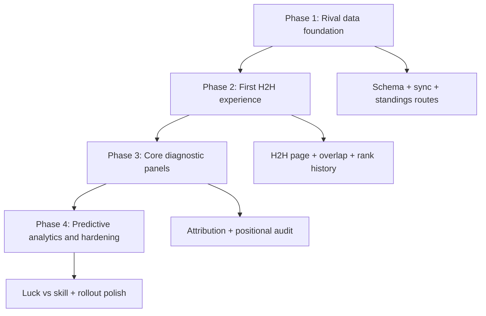

# feat: H2H Mini-League Delivery Schedule

## Overview

This plan turns the PRD in `docs/prd/prd_fpl_diagnostic_analytics_h2h_mini_league.md` into a phased implementation schedule for shipping H2H diagnostic analytics inside the existing FPLytics product. The goal is to land value in stages instead of holding the entire feature until every analytical surface is complete.

The delivery strategy is:
- establish rival data infrastructure first
- ship a first comparison experience early
- add the core diagnostic slices next
- finish with the highest-risk predictive analytics and rollout hardening

## Problem Frame

The PRD asks for a user to compare their team against a specific mini-league rival and understand whether the points gap comes from captaincy, transfer behavior, bench usage, squad structure, or short-term luck. The repo already supports user-specific team sync, player analytics, xPts, and transfer analysis, but it does not yet persist rival data or expose a rival comparison experience.

That makes delivery sequencing the main planning problem. Rival sync, storage, and routing must land before any of the user-facing diagnostics can be trusted. Once that foundation exists, the features can be staggered so the team can ship useful slices earlier and reserve the most model-sensitive work for last.

## Requirements Trace

- R1. Support choosing a mini-league rival and loading a dedicated H2H comparison view.
- R2. Deliver points attribution breakdown for captaincy, transfer efficiency/hits, and bench impact.
- R3. Deliver positional audit and value-per-million comparison.
- R4. Deliver a luck-vs-skill view based on expected vs actual points.
- R5. Deliver overlap and differential player comparison plus manager history.
- R6. Use existing FPL and xPts infrastructure without requiring rival authentication.
- R7. Preserve existing security, account isolation, and repo conventions while introducing rival analytics.

## Scope Boundaries

- In scope: current-season H2H comparison against one chosen rival at a time.
- In scope: public rival data sync from FPL standings, picks, and history endpoints.
- In scope: a new H2H page and supporting sidebar entry path.
- Out of scope: multi-season GW-level manager history across past seasons.
- Out of scope: bulk sync of an entire mini-league before the user has chosen a rival.
- Out of scope: background job infrastructure, streaming progress infrastructure, or a separate league-selection application surface.

## Context & Research

### Relevant Code and Patterns

- `apps/api/src/services/queryService.ts`
  Existing analytics/query aggregation surface and natural delegation parent for H2H-specific logic.
- `apps/api/src/services/managerRoiService.ts`
  Existing focused-service pattern that keeps `QueryService` from absorbing unrelated analytical concerns.
- `apps/api/src/my-team/myTeamSyncService.ts`
  Closest existing sync/persistence workflow for season and GW-level manager data.
- `apps/api/src/routes/createApiRouter.ts`
  Existing API route registration, validation, and service wiring conventions.
- `apps/api/src/db/database.ts`
  Existing migration-safe startup logic, `ensureColumns()`, and index/pragma hooks.
- `apps/api/src/client/fplApiClient.ts`
  Existing public-data API client seam for new rival fetch calls.
- `packages/contracts/src/index.ts`
  Shared response contract location for new H2H types.
- `apps/web/src/api/client.ts`
  Existing request helper conventions and typed client surface.
- `apps/web/src/pages/MyTeamPage.tsx`
  Best local pattern for async page state, cache behavior, and param-driven data loading.
- `apps/web/src/components/layout/Sidebar.tsx`
  Natural entry point for the mini-league comparison workflow.

### Institutional Learnings

- `docs/solutions/logic-errors/historical-replay-xpts-inflation-query-service-20260327.md`
  Any xPts-derived aggregation for the luck-vs-skill phase must remain minute-weighted to avoid low-minute cameo inflation.

### External References

- No external research was needed. The codebase already contains strong local patterns for sync, analytics services, and React page composition, and the user asked specifically for a delivery schedule rather than framework research.

## Key Technical Decisions

- Use the PRD as the source of truth and create a brand-new plan file.
  Rationale: the user explicitly requested a fresh plan artifact rather than another update to the existing same-day plan.

- Treat this as a Deep plan.
  Rationale: the feature is cross-cutting across schema, sync, contracts, API, analytics services, and frontend rendering.

- Sequence delivery by dependency and risk, not PRD section order.
  Rationale: overlap/history can ship earlier than luck-vs-skill even though both are PRD features.

- Sync one rival on demand rather than the full league.
  Rationale: it delivers the required user path with much lower implementation and operational complexity.

- Extract H2H logic into a dedicated service instead of continuing to grow `QueryService`.
  Rationale: this follows the repo’s existing analytical service pattern and keeps H2H logic cohesive.

## Open Questions

### Resolved During Planning

- Should this update the earlier 2026-04-13 plan?
  No. The user asked to start from scratch and create a new file, so this plan is a new artifact.

- Is a brainstorm-origin requirements doc available?
  No matching `docs/brainstorms/*-requirements.md` file exists, so the PRD is the planning source.

- Is external research warranted?
  No. The repo already has enough local precedent for the required architecture.

### Deferred to Implementation

- Exact contract naming and response field granularity for each H2H section.
  These should be settled while aligning service outputs with the actual page composition.

- Exact visualization details for each diagnostic panel.
  The plan fixes sequencing and file ownership, but chart/card shape should be finalized during implementation.

- Final threshold values for user-facing flags such as “running hot” and “under-indexing.”
  These require implementation-time validation against seeded or real historical data.

## High-Level Technical Design

> *This illustrates the intended approach and is directional guidance for review, not implementation specification. The implementing agent should treat it as context, not code to reproduce.*

## Phased Delivery

### Phase 1: Rival Data Foundation

Land the minimum backend foundation needed to support any rival comparison:
- rival tables and migrations
- rival standings lookup
- on-demand rival sync
- shared contracts and route plumbing

Why this phase lands first:
- every other feature depends on persisted rival data
- it creates a stable seam for backend and frontend work to converge on
- it exposes integration risks early, especially account scoping and sync behavior

### Phase 2: First User-Visible Comparison Slice

Ship a usable H2H page with:
- rival selection flow
- overlap percentage
- differential players
- current-season manager history

Why this phase lands second:
- it provides immediate user value with lower analytical risk
- it validates the page structure, caching strategy, and API composition before more complex metrics are layered in

### Phase 3: Core Diagnostic Panels

Add the explanatory “why am I ahead/behind?” surfaces:
- points attribution breakdown
- positional audit
- value-per-million comparison

Why this phase lands third:
- these features depend on rival data but not on the highest-risk xPts computations
- this phase delivers the strongest strategic insight from the PRD

### Phase 4: Predictive Signal and Release Hardening

Finish with:
- luck-vs-skill index
- edge-case handling
- stale-sync UX
- performance and regression hardening

Why this phase lands last:
- it depends on the most statistically sensitive calculations
- it benefits from the already-proven H2H page and query composition

## Implementation Units

- [x] **Unit 1: Build rival sync and persistence infrastructure**

**Goal:** Create the backend data model and sync flow that makes rival comparison possible.

**Requirements:** R1, R6, R7

**Dependencies:** None

**Files:**
- Modify: `apps/api/src/db/schema.ts`
- Modify: `apps/api/src/db/database.ts`
- Modify: `apps/api/src/client/fplApiClient.ts`
- Modify: `apps/api/src/routes/createApiRouter.ts`
- Modify: `apps/api/src/chat/schemaContext.ts`
- Modify: `apps/api/src/config/env.ts`
- Create: `apps/api/src/services/rivalSyncService.ts`
- Test: `apps/api/test/rivalSyncService.test.ts`
- Test: `apps/api/test/app.test.ts`

**Approach:**
- Add dedicated rival storage instead of overloading `my_team_*` tables.
- Reuse the existing FPL client and route wiring conventions for rival standings and per-entry history/picks.
- Implement on-demand single-rival sync to minimize initial delivery complexity and avoid needing background orchestration.
- Capture enough sync metadata to support re-sync and stale-data messaging later.

**Patterns to follow:**
- `apps/api/src/my-team/myTeamSyncService.ts`
- `apps/api/src/db/database.ts`
- `apps/api/src/routes/createApiRouter.ts`

**Test scenarios:**
- Rival standings fetch returns stable normalized rows across multiple pages.
- Syncing one rival persists picks and per-GW summaries without duplicate rows.
- Missing or private rival data fails gracefully.
- Account isolation prevents cross-user rival leakage.

**Verification:**
- A caller can fetch league standings, choose a rival entry, trigger sync, and observe persisted rival rows backing later analytics.

- [x] **Unit 2: Create the H2H contracts, query service, and first comparison endpoint**

**Goal:** Add the shared data model and backend orchestration needed for a dedicated H2H comparison response.

**Requirements:** R1, R5, R6, R7

**Dependencies:** Unit 1

**Files:**
- Modify: `packages/contracts/src/index.ts`
- Create: `apps/api/src/services/h2hQueryService.ts`
- Modify: `apps/api/src/services/queryService.ts`
- Modify: `apps/api/src/routes/createApiRouter.ts`
- Test: `apps/api/test/h2hQueryService.test.ts`
- Test: `apps/api/test/app.test.ts`

**Approach:**
- Add H2H-specific response types to the contracts package.
- Extract a dedicated `H2HQueryService` and delegate to it from `QueryService` to match the repo’s service composition style.
- Start with overlap, differential, rival identity, and manager-history queries so the first page slice can ship before the full diagnostics set exists.

**Patterns to follow:**
- `apps/api/src/services/managerRoiService.ts`
- `apps/api/src/services/queryService.ts`

**Test scenarios:**
- Overlap calculations include the intended squad slots.
- Differential players are correctly partitioned for user and rival.
- Manager history only returns periods where both sides have relevant current-season data.

**Verification:**
- The API can serve a coherent H2H payload for a synced rival without requiring frontend composition of multiple endpoints.

- [x] **Unit 3: Ship the Phase 2 frontend experience**

**Goal:** Deliver the first end-to-end user-visible H2H workflow from sidebar entry to comparison page.

**Requirements:** R1, R5, R7

**Dependencies:** Units 1-2

**Files:**
- Modify: `apps/web/src/api/client.ts`
- Modify: `apps/web/src/App.tsx`
- Modify: `apps/web/src/components/layout/Sidebar.tsx`
- Create: `apps/web/src/pages/H2HPage.tsx`
- Create: `apps/web/src/pages/h2hPageUtils.ts`
- Test: `apps/web/src/pages/H2HPage.test.tsx`

**Approach:**
- Add a sidebar-driven mini-league entry path consistent with the existing app shell.
- Mirror `MyTeamPage`’s local async-state and caching posture so route changes and retries behave predictably.
- Render rival identity, overlap percentage, differential players, and current-season manager history as the first release slice.

**Execution note:** Start with a failing page test around rival-switch navigation and cache correctness; this area is easy to regress when route params change without a full remount.

**Patterns to follow:**
- `apps/web/src/pages/MyTeamPage.tsx`
- `apps/web/src/api/client.ts`
- `apps/web/src/components/layout/Sidebar.tsx`

**Test scenarios:**
- The H2H page loads a synced rival correctly from route params.
- Switching rivals does not show stale cached data from the previous rival.
- Empty and sync-required states remain understandable.

**Verification:**
- A user can navigate from the app shell into a real H2H comparison page and see overlap/history for a chosen rival.

- [ ] **Unit 4: Add points attribution breakdown**

**Goal:** Explain point deltas through captaincy, transfer behavior, and bench usage.

**Requirements:** R2, R7

**Dependencies:** Units 1-3

**Files:**
- Modify: `packages/contracts/src/index.ts`
- Modify: `apps/api/src/services/h2hQueryService.ts`
- Modify: `apps/api/src/routes/createApiRouter.ts`
- Modify: `apps/web/src/api/client.ts`
- Modify: `apps/web/src/pages/H2HPage.tsx`
- Modify: `apps/web/src/pages/h2hPageUtils.ts`
- Test: `apps/api/test/h2hQueryService.test.ts`
- Test: `apps/web/src/pages/H2HPage.test.tsx`

**Approach:**
- Add captaincy, transfer-hit, transfer-efficiency, and bench-impact calculations to the H2H response.
- Preserve meaningful nullability where “no transfer” or “insufficient comparison data” differs from a numeric zero.
- Introduce attribution UI after the page skeleton already exists, so the team can verify section design in a live context instead of designing in isolation.

**Patterns to follow:**
- `apps/api/src/services/queryService.ts`
- `apps/web/src/pages/MyTeamPage.tsx`

**Test scenarios:**
- Captain multiplier logic distinguishes standard captaincy from special-chip multipliers.
- Bench scoring covers the intended bench slots consistently.
- Transfer-hit behavior distinguishes “no hit” from “hit worth zero gain.”

**Verification:**
- The H2H page can explain a known points gap using attribution fields that reconcile with stored GW totals.

- [ ] **Unit 5: Add positional audit and value-per-million comparison**

**Goal:** Show where each manager’s squad structure is outperforming or underperforming by position and spend efficiency.

**Requirements:** R3, R7

**Dependencies:** Units 1-4

**Files:**
- Modify: `packages/contracts/src/index.ts`
- Modify: `apps/api/src/services/h2hQueryService.ts`
- Modify: `apps/web/src/pages/H2HPage.tsx`
- Modify: `apps/web/src/pages/h2hPageUtils.ts`
- Test: `apps/api/test/h2hQueryService.test.ts`
- Test: `apps/web/src/pages/H2HPage.test.tsx`

**Approach:**
- Aggregate points and cost by positional bucket across the chosen comparison range.
- Add value-per-million outputs that respect the app’s stored FPL cost representation.
- Keep any attacking-defender heuristics aligned with the repo’s existing xPts/statistical conventions rather than ad hoc averages.

**Execution note:** Add characterization coverage before finalizing any positional efficiency heuristics so the comparison does not drift into noisy or unstable labels.

**Patterns to follow:**
- `docs/solutions/logic-errors/historical-replay-xpts-inflation-query-service-20260327.md`
- `apps/api/src/services/queryService.ts`

**Test scenarios:**
- Value-per-million reflects the correct cost basis.
- Positional group totals reconcile with stored squad composition.
- Small differences do not generate misleading under-index conclusions.

**Verification:**
- The page identifies where the user trails or leads by position with both raw output and efficiency context.

- [ ] **Unit 6: Add luck-vs-skill index**

**Goal:** Deliver the expected-vs-actual comparison that distinguishes sustainable performance from variance.

**Requirements:** R4, R6, R7

**Dependencies:** Units 1-5

**Files:**
- Modify: `packages/contracts/src/index.ts`
- Modify: `apps/api/src/services/h2hQueryService.ts`
- Modify: `apps/api/src/services/queryService.ts`
- Modify: `apps/web/src/pages/H2HPage.tsx`
- Modify: `apps/web/src/pages/h2hPageUtils.ts`
- Test: `apps/api/test/h2hQueryService.test.ts`
- Test: `apps/api/test/queryService.test.ts`
- Test: `apps/web/src/pages/H2HPage.test.tsx`

**Approach:**
- Reuse the existing xPts machinery instead of inventing a parallel model pipeline.
- Keep xPts derivation minute-weighted and explicitly aligned with the historical replay inflation fix.
- Surface the result as a probabilistic diagnostic, not a hard verdict, to stay faithful to the PRD’s “luck vs skill” framing.

**Execution note:** Implement this test-first against representative xPts edge cases, because this is the most model-sensitive unit in the schedule.

**Patterns to follow:**
- `apps/api/src/services/queryService.ts`
- `docs/solutions/logic-errors/historical-replay-xpts-inflation-query-service-20260327.md`

**Test scenarios:**
- Expected-vs-actual totals reconcile with player-level xPts inputs.
- Low-minute cameo rows do not inflate the rival’s perceived process quality.
- Missing fixture/xPts data degrades gracefully instead of forcing fake certainty.

**Verification:**
- The page can distinguish rival overperformance from sustainable expected output without reintroducing known xPts aggregation bugs.

- [ ] **Unit 7: Release hardening, stale-data UX, and regression coverage**

**Goal:** Make the full feature ship-ready after all analytics slices exist.

**Requirements:** R1-R7

**Dependencies:** Units 1-6

**Files:**
- Modify: `apps/api/src/services/h2hQueryService.ts`
- Modify: `apps/api/src/routes/createApiRouter.ts`
- Modify: `apps/web/src/api/client.ts`
- Modify: `apps/web/src/pages/H2HPage.tsx`
- Modify: `apps/web/src/components/layout/Sidebar.tsx`
- Modify: `apps/api/src/chat/schemaContext.ts`
- Test: `apps/api/test/app.test.ts`
- Test: `apps/api/test/h2hQueryService.test.ts`
- Test: `apps/web/src/pages/H2HPage.test.tsx`

**Approach:**
- Add stale-sync, missing-data, and retry UX that reflects the single-rival sync model.
- Close integration gaps around cache invalidation, route transitions, and sync-required states.
- Ensure schema annotations and any operational docs keep pace with the new tables and analytics surfaces.

**Patterns to follow:**
- `apps/web/src/pages/MyTeamPage.tsx`
- `apps/api/src/chat/schemaContext.ts`

**Test scenarios:**
- A stale or unsynced rival produces a recoverable user path rather than a dead-end page.
- Re-sync flows do not leave stale comparison data in cache.
- Full composite payload renders all sections without layout or state collisions.

**Verification:**
- The H2H experience behaves predictably across fresh sync, stale sync, missing data, and rival switching flows.

## System-Wide Impact

- **Interaction graph:** schema, sync services, API routes, shared contracts, page routing, sidebar navigation, and H2H rendering all change together.
- **Error propagation:** rival sync and H2H query failures must terminate in explicit user-facing states rather than leaking raw service errors into the page.
- **State lifecycle risks:** stale sync metadata, rival-switch cache collisions, and partial syncs are the main lifecycle concerns.
- **API surface parity:** H2H endpoints should follow existing typed-client and aggregated-response conventions rather than fragmenting into many ad hoc shapes.
- **Integration coverage:** route-level API tests plus page tests are necessary because service unit tests alone will not prove the multi-step H2H flow.

## Risks & Dependencies

- Rival features depend on public FPL endpoints remaining available and reasonably consistent.
- Sync time and rate-limiting behavior can become a UX bottleneck if rival history is fetched too eagerly.
- The luck-vs-skill phase depends on correct reuse of existing xPts logic and inherits its modeling sensitivities.
- The repo has no project-level `AGENTS.md`, so guidance here is derived from codebase conventions rather than repository policy files.

## Documentation / Operational Notes

- Update `apps/api/src/chat/schemaContext.ts` when new rival tables land so chat and MCP tooling stay accurate.
- Keep any sync cap or rival-selection assumptions documented near config rather than buried only in code.
- If the rollout depends on manual re-sync, the UX should make that explicit to end users.

## Alternative Approaches Considered

- Full mini-league bulk sync first.
  Rejected because it front-loads the highest operational cost before proving the user flow.

- Ship all four PRD features in a single release cut.
  Rejected because it would delay useful feedback until the highest-risk analytics work is also complete.

- Put luck-vs-skill ahead of overlap/history.
  Rejected because overlap/history is simpler, more dependable, and better suited to an early slice.

## Success Metrics

- The team can ship a useful first H2H slice before the full analytical suite is complete.
- Each later phase builds on already-shipped seams rather than reworking earlier architecture.
- The final release satisfies all four PRD feature areas without requiring a rewrite of the earlier phases.

## Sources & References

- **Origin document:** [docs/prd/prd_fpl_diagnostic_analytics_h2h_mini_league.md](/Users/iha/github/ianha/fplytics/docs/prd/prd_fpl_diagnostic_analytics_h2h_mini_league.md)
- Related code: [queryService.ts](/Users/iha/github/ianha/fplytics/apps/api/src/services/queryService.ts), [managerRoiService.ts](/Users/iha/github/ianha/fplytics/apps/api/src/services/managerRoiService.ts), [myTeamSyncService.ts](/Users/iha/github/ianha/fplytics/apps/api/src/my-team/myTeamSyncService.ts), [MyTeamPage.tsx](/Users/iha/github/ianha/fplytics/apps/web/src/pages/MyTeamPage.tsx)
- Institutional learning: [historical-replay-xpts-inflation-query-service-20260327.md](/Users/iha/github/ianha/fplytics/docs/solutions/logic-errors/historical-replay-xpts-inflation-query-service-20260327.md)
